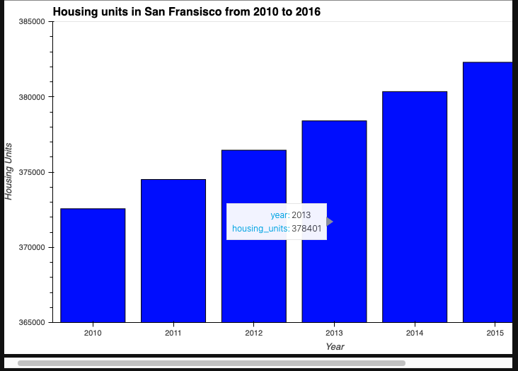
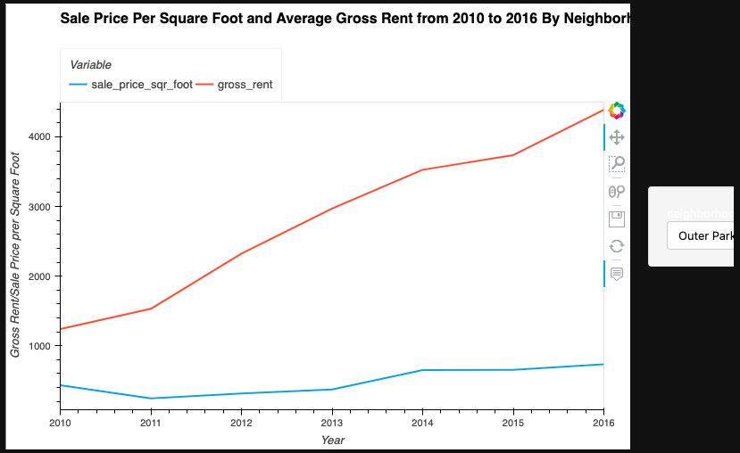

# Columbia_Fintech_Challenge_06_SanFransico_Rent_Analysis


## Description

I have created a program that will analyze the San Fransisco real estate market from 2010 to 2016. The anaysis looks at the gross rent and the sale price per square foot in the time frame and breaks it down by neighborhood. 






---

## Technologies

This project leverages JupyterLab Version 3.0.14 in association with Anaconda distribution and the Conda package manager.  The following packages are also used: 

* [pandas](https://github.com/pandas-dev/pandas) - For the current source code hosted on GitHub.


## Installation Guide

The dependencies used are included when using Anaconda distribution and Conda package manager to manage the Python environment.  No additional installations are required.

### Imported Libraries and Dependencies

```python
   import pandas as pd
   from pathlib import Path
   %matplotlib inline
```


---
## **Contributors**

### **Author**

Tommy Magee
[LinkedIn](https://www.linkedin.com/in/thomas-magee-2009a72a/)


### **BootCamp lead instructor**

Vinicio De Sola


---

## License

MIT License

Copyright (c) [2023] [Thomas 'Tommy' Magee]

Permission is hereby granted, free of charge, to any person obtaining a copy
of this software and associated documentation files (the "Software"), to deal
in the Software without restriction, including without limitation the rights
to use, copy, modify, merge, publish, distribute, sublicense, and/or sell
copies of the Software, and to permit persons to whom the Software is
furnished to do so, subject to the following conditions:

The above copyright notice and this permission notice shall be included in all
copies or substantial portions of the Software.

THE SOFTWARE IS PROVIDED "AS IS", WITHOUT WARRANTY OF ANY KIND, EXPRESS OR
IMPLIED, INCLUDING BUT NOT LIMITED TO THE WARRANTIES OF MERCHANTABILITY,
FITNESS FOR A PARTICULAR PURPOSE AND NONINFRINGEMENT. IN NO EVENT SHALL THE
AUTHORS OR COPYRIGHT HOLDERS BE LIABLE FOR ANY CLAIM, DAMAGES OR OTHER
LIABILITY, WHETHER IN AN ACTION OF CONTRACT, TORT OR OTHERWISE, ARISING FROM,
OUT OF OR IN CONNECTION WITH THE SOFTWARE OR THE USE OR OTHER DEALINGS IN THE
SOFTWARE.

